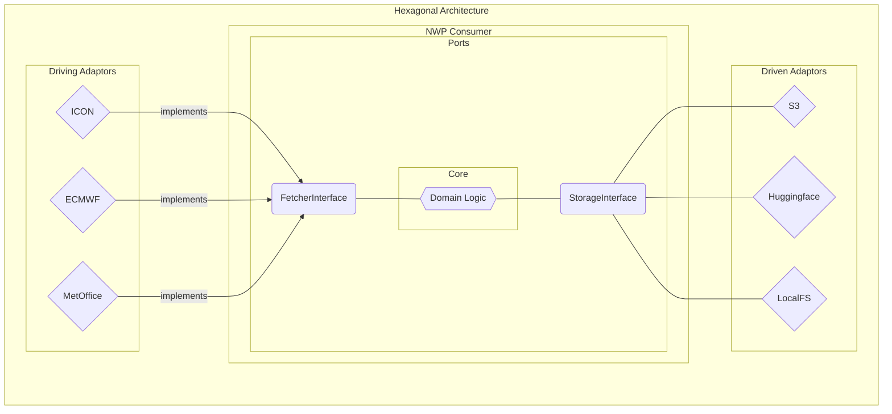

# Architecture

This document describes the high level architecture of the nwp-consumer project.

## Birds-eye view

At the top level, the consumer downloads raw NWP data, processes it to zarr, and saves it to a storage backend.

It is built following the hexagonal architecture pattern.
This pattern is used to separate the core business logic from the driving and driven adaptors.
The core business logic is the `service` module, which contains the domain logic.
This logic is agnostic to the driving and driven actors,
instead relying on abstract classes as the ports to interact with them.

## Entry Points

`src/nwp_consumer/cmd/main.py` contains the main function which runs the consumer.

`src/nwp_consumer/internal/service/consumer.py` contains the `NWPConsumer` class,
the methods of which are the business use cases of the consumer.

`StorageInterface` and `FetcherInterface` classes define the ports used by driving and driven actors.

`src/nwp_consumer/internal/inputs` contains the adaptors for the driving actors.

`src/nwp_consumer/internal/outputs` contains the adaptors for the driven actors.

